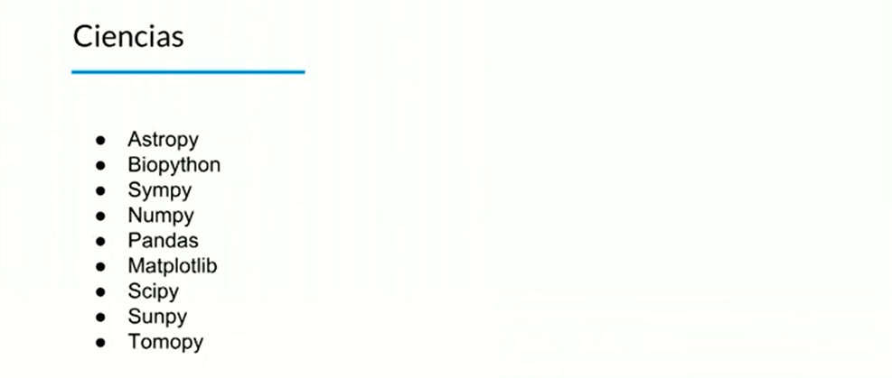

# Python en el mundo real 

### python es un lenguaje que tiene mucho auge en la vida, es utilizado gracias por su extensidad en las librerias, existen las siguientes librerias. 

## - Astropy = Análisis de las estrellas o astrofica
## - Biopython = Biologia computacional 
## - Sympy = Analizar la biosfera
## - Numpy = Ciencia de datos
## - Pandas = Ciencia de datos
## - Matplotlib = Ciencia de datos
## - Tomopy = Analisis de medicina

# CLI

# Aplicaciones Web
